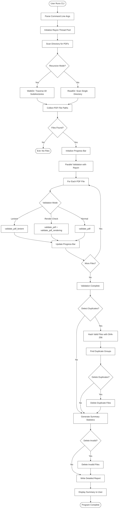
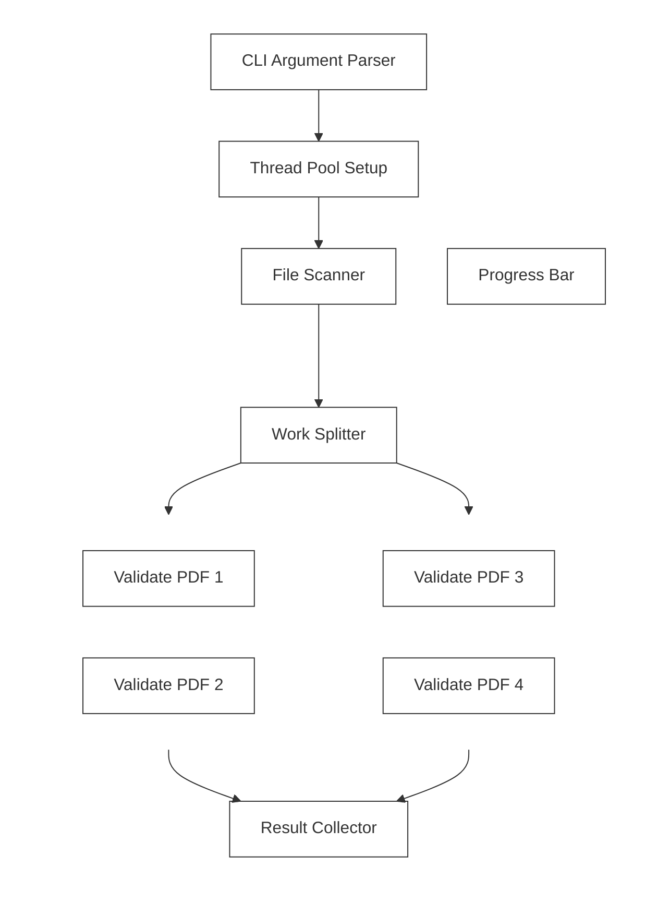
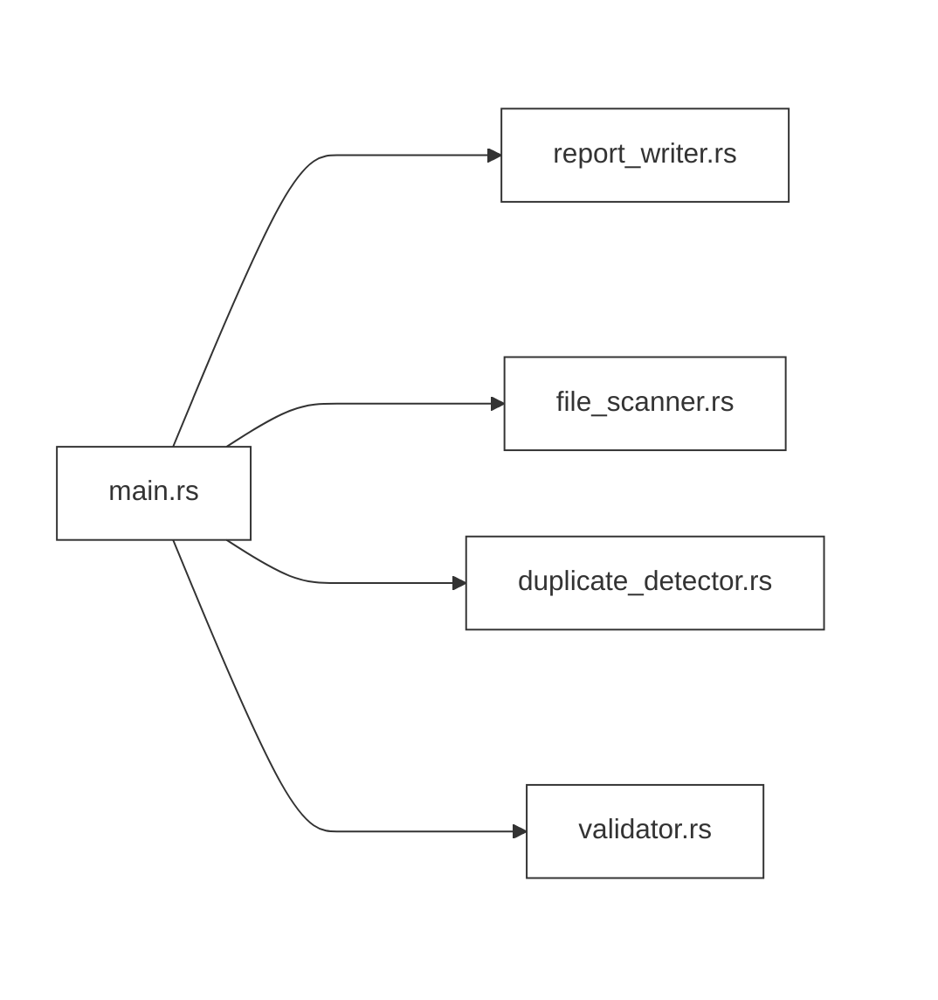

# PDF Validator (Rust Edition)

A high-performance, parallel PDF validation tool written in Rust. Validates PDF files for corruption, detects duplicates, and provides comprehensive reporting.

## Features

- **Parallel Processing**: Uses Rayon for multi-threaded validation
- **Recursive Directory Scanning**: Process entire directory trees
- **Duplicate Detection**: SHA-256 based duplicate file detection
- **Multiple Validation Modes**:
  - Strict validation (default)
  - Lenient mode for PDFs with minor issues
  - Optional rendering validation
- **Batch Operations**:
  - Delete invalid PDFs automatically
  - Remove duplicate files
- **Progress Tracking**: Real-time progress bar with indicatif
- **Detailed Reporting**: Comprehensive validation reports

## Installation

### Prerequisites

- Rust 1.70 or higher
- Cargo (comes with Rust)

### Build from Source

```bash
git clone https://github.com/danindiana/pdf_validator_rs.git
cd pdf_validator_rs
cargo build --release
```

The compiled binary will be at `target/release/pdf_validator_rs`

## Usage

### Basic Usage

```bash
# Validate PDFs in a single directory
cargo run --release -- /path/to/pdfs

# Recursive validation through subdirectories
cargo run --release -- /path/to/pdfs --recursive
```

### Command-Line Options

```
pdf_validator_rs [OPTIONS] <DIRECTORY>

Arguments:
  <DIRECTORY>  Target directory to scan for PDF files

Options:
  -r, --recursive              Scan directories recursively
  -w, --workers <WORKERS>      Number of parallel worker threads (default: number of CPUs)
  -o, --output <OUTPUT>        Output report filename [default: validation_report_rust.txt]
      --delete-invalid         Delete invalid/corrupted PDF files
  -v, --verbose                Verbose output
      --detect-duplicates      Detect and report duplicate files
      --delete-duplicates      Delete duplicate PDF files (requires --detect-duplicates)
      --batch                  Run in batch mode (no interactive prompts, no progress bar)
      --no-render-check        Skip rendering quality checks (faster validation)
      --lenient                Use lenient parsing mode (accept more PDFs with minor issues)
  -h, --help                   Print help
```

### Examples

**Validate recursively with progress bar:**
```bash
cargo run --release -- /path/to/pdfs --recursive
```

**Detect and remove duplicates:**
```bash
cargo run --release -- /path/to/pdfs -r --detect-duplicates --delete-duplicates
```

**Lenient mode for edge cases:**
```bash
cargo run --release -- /path/to/pdfs -r --lenient
```

**Delete invalid PDFs automatically:**
```bash
cargo run --release -- /path/to/pdfs -r --delete-invalid
```

**Batch mode for scripting:**
```bash
cargo run --release -- /path/to/pdfs -r --batch --output batch_report.txt
```

**Custom worker threads:**
```bash
cargo run --release -- /path/to/pdfs -r --workers 16
```

## Validation Report

The tool generates a detailed report (default: `validation_report_rust.txt`) containing:

- Total files processed
- Valid vs invalid file counts
- List of invalid files with full paths
- Duplicate file groups (if duplicate detection enabled)
- Processing statistics

## Architecture & Design

### Overall Program Flow

The PDF validator follows a systematic workflow from CLI input to final report generation:



[View detailed flow diagram](docs/diagrams/overall-flow.md)

### Validation Strategy

The validator employs multiple validation strategies with fallback mechanisms:

```mermaid
%%{init: {'theme':'base', 'themeVariables': { 'primaryColor':'#fff0','primaryTextColor':'#333','primaryBorderColor':'#333','lineColor':'#333','secondaryColor':'#fff0','tertiaryColor':'#fff0','background':'#fff0','mainBkg':'#fff0','secondBkg':'#fff0'}}}%%
flowchart TD
    Start([PDF File Path]) --> ModeCheck{Validation Mode}
    ModeCheck -->|Normal/Strict| NormalPath[validate_pdf]
    ModeCheck -->|Lenient| LenientPath[validate_pdf_lenient]
    ModeCheck -->|Rendering| RenderPath[validate_pdf + validate_pdf_rendering]
    NormalPath --> Lopdf1[Try: validate_pdf_with_lopdf]
    Lopdf1 --> LopdfCheck1{Success?}
    LopdfCheck1 -->|Yes| PageCheck1{Has Pages?}
    PageCheck1 -->|Yes| Valid1([Return: VALID])
    PageCheck1 -->|No| Invalid1([Return: INVALID])
    LopdfCheck1 -->|No| Fallback1[Try: validate_pdf_basic]
    Fallback1 --> BasicResult1{Basic Valid?}
    BasicResult1 -->|Yes| Valid2([Return: VALID])
    BasicResult1 -->|No| Invalid2([Return: INVALID])
```

[View complete validation strategy](docs/diagrams/validation-strategy.md)

### Parallel Processing Architecture

The tool leverages Rayon for efficient parallel processing:



[View detailed parallel architecture](docs/diagrams/parallel-architecture.md)

### Module Structure



[View detailed module structure](docs/diagrams/module-structure.md)

## Project Structure

```
pdf_validator_rs/
├── src/
│   ├── main.rs              # CLI entry point
│   ├── lib.rs               # Library exports
│   ├── core/                # Core validation logic
│   │   ├── mod.rs
│   │   └── validator.rs     # PDF validation functions
│   ├── scanner/             # File scanning & duplicate detection
│   │   ├── mod.rs
│   │   ├── file_scanner.rs
│   │   └── duplicate_detector.rs
│   └── reporting/           # Report generation
│       ├── mod.rs
│       └── report_writer.rs
├── docs/
│   └── diagrams/            # Architecture diagrams
│       ├── overall-flow.md
│       ├── validation-strategy.md
│       ├── parallel-architecture.md
│       └── module-structure.md
├── examples/
│   └── diagnose_discrepancies.rs  # Diagnostic tool
├── Cargo.toml
└── README.md
```

## Performance

- **Parallel Processing**: Utilizes all available CPU cores
- **Memory Efficient**: Streaming validation without loading entire PDFs
- **Optimized Build**: Release builds use LTO and aggressive optimization
- **Progress Tracking**: Minimal overhead with batched updates

## Dependencies

- **clap**: Command-line argument parsing
- **rayon**: Data parallelism library
- **lopdf**: PDF parsing and validation
- **walkdir**: Recursive directory traversal
- **sha2**: SHA-256 hashing for duplicate detection
- **indicatif**: Progress bars and spinners
- **anyhow**: Error handling

## Optional Features

### Rendering Validation (Coming Soon)

Enable the `rendering` feature for additional validation:

```bash
cargo build --release --features rendering
```

This adds pdfium-render support to validate that PDFs can be rendered correctly.

## Error Handling

The validator uses multiple validation strategies:

1. **Basic Validation**: Checks PDF structure and syntax
2. **Lenient Mode**: More permissive parsing for edge cases
3. **Rendering Check**: Optional page rendering validation (when feature enabled)

## Examples

### Diagnostic Tool

Check for discrepancies between validation results:

```bash
cargo run --example diagnose_discrepancies -- file1.pdf file2.pdf file3.pdf
```

## Contributing

Contributions are welcome! Please feel free to submit a Pull Request.

## License

This project is open source. See LICENSE file for details.

## Acknowledgments

Built with Rust and powered by:
- The amazing Rust PDF ecosystem
- Rayon for fearless parallelism
- The Rust community

---

**Generated with [Claude Code](https://claude.com/claude-code)**
