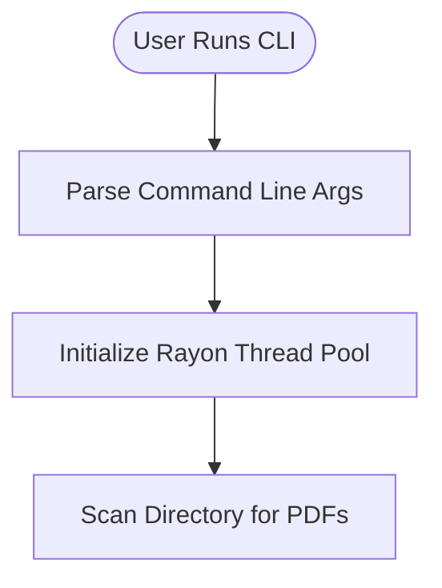

# PDF Validator Documentation

Welcome to the comprehensive documentation for PDF Validator v1.0.0.

## 📚 Documentation Index

### Getting Started

1. **[Main README](../README.md)** - Project overview, installation, and quick start
2. **[Build Guide](BUILD_GUIDE.md)** - Comprehensive build instructions and compilation options
3. **[Changelog](../CHANGELOG.md)** - Version history and release notes

### Technical Documentation

4. **[API Reference](API_REFERENCE.md)** - Complete API documentation for library usage
5. **[Performance Guide](PERFORMANCE.md)** - Benchmarking, optimization, and tuning

### Architecture Diagrams

6. **[Overall Program Flow](diagrams/overall-flow.md)** - Complete execution workflow
7. **[Validation Strategy](diagrams/validation-strategy.md)** - Multi-mode validation approach
8. **[Parallel Architecture](diagrams/parallel-architecture.md)** - Rayon threading model
9. **[Module Structure](diagrams/module-structure.md)** - Code organization and dependencies

## 🚀 Quick Links

### For Users

- **Installation**: See [Build Guide](BUILD_GUIDE.md#build-from-source)
- **Usage Examples**: See [Main README](../README.md#examples)
- **Troubleshooting**: See [Build Guide](BUILD_GUIDE.md#troubleshooting)
- **Performance Tips**: See [Performance Guide](PERFORMANCE.md#optimization-strategies)

### For Developers

- **API Documentation**: See [API Reference](API_REFERENCE.md)
- **Module Overview**: See [Module Structure](diagrams/module-structure.md)
- **Contributing**: See [Main README](../README.md#contributing)
- **Build Profiles**: See [Build Guide](BUILD_GUIDE.md#build-profiles)

### For Performance Tuning

- **Benchmarking**: See [Performance Guide](PERFORMANCE.md#benchmarking)
- **Worker Configuration**: See [Performance Guide](PERFORMANCE.md#tuning-parameters)
- **Scalability Analysis**: See [Performance Guide](PERFORMANCE.md#scalability-analysis)

## 📖 Documentation Overview

### Build Guide (`BUILD_GUIDE.md`)

Complete instructions for building from source, including:
- Prerequisites and system requirements
- Debug vs. Release builds
- Optimization options
- Cross-compilation
- Troubleshooting build issues

**Key Sections:**
- [Prerequisites](BUILD_GUIDE.md#prerequisites)
- [Build Profiles](BUILD_GUIDE.md#build-profiles)
- [Feature Flags](BUILD_GUIDE.md#feature-flags)
- [Troubleshooting](BUILD_GUIDE.md#troubleshooting)

### API Reference (`API_REFERENCE.md`)

Comprehensive library API documentation:
- All public functions and types
- Usage examples
- Thread safety guarantees
- Performance considerations

**Key Sections:**
- [Core Module](API_REFERENCE.md#core-module) - Validation functions
- [Scanner Module](API_REFERENCE.md#scanner-module) - File collection
- [Reporting Module](API_REFERENCE.md#reporting-module) - Report generation
- [Usage Examples](API_REFERENCE.md#usage-examples)

### Performance Guide (`PERFORMANCE.md`)

Performance characteristics and optimization:
- Benchmarking methodology
- Scalability analysis
- Resource usage
- Tuning parameters

**Key Sections:**
- [Benchmarking](PERFORMANCE.md#benchmarking)
- [Performance Characteristics](PERFORMANCE.md#performance-characteristics)
- [Optimization Strategies](PERFORMANCE.md#optimization-strategies)
- [Real-World Tips](PERFORMANCE.md#real-world-performance-tips)

### Architecture Diagrams

Visual representations of system architecture:

#### Overall Program Flow

[View Full Diagram](diagrams/overall-flow.md)

#### Validation Strategy
Multi-mode validation with fallback mechanisms.
[View Full Diagram](diagrams/validation-strategy.md)

#### Parallel Architecture
Rayon-based parallel processing design.
[View Full Diagram](diagrams/parallel-architecture.md)

#### Module Structure
Code organization and dependency graph.
[View Full Diagram](diagrams/module-structure.md)

## 🎯 Common Tasks

### How do I...

#### ...build the project?
```bash
cargo build --release
```
See [Build Guide](BUILD_GUIDE.md#build-from-source) for details.

#### ...use the library in my project?
```rust
use pdf_validator_rs::prelude::*;
```
See [API Reference](API_REFERENCE.md#usage-examples) for examples.

#### ...optimize performance?
```bash
pdf_validator_rs /path -r --workers 16 --batch
```
See [Performance Guide](PERFORMANCE.md#optimization-strategies) for tuning.

#### ...validate PDFs recursively?
```bash
pdf_validator_rs /path/to/pdfs --recursive
```
See [Main README](../README.md#basic-usage) for all options.

#### ...detect duplicates?
```bash
pdf_validator_rs /path -r --detect-duplicates
```
See [Main README](../README.md#examples) for more examples.

## 🔧 Technical Specifications

### System Requirements

- **Rust**: 1.70 or higher
- **OS**: Linux (Ubuntu 20.04+), macOS, Windows 10+
- **RAM**: 2GB minimum (4GB recommended)
- **Disk**: 500MB for build artifacts

### Build Environment (v1.0.0)

- **Rust**: 1.90.0
- **Cargo**: 1.90.0
- **OS**: Ubuntu 22.04.5 LTS
- **Kernel**: 6.8.0-87-generic

See [Build Information](../README.md#build-information) for complete details.

## 📊 Performance Summary

**Key Metrics:**
- **Throughput**: ~125-143 files/second (8-16 workers, SSD)
- **Memory**: ~130 bytes per file
- **Scaling**: Near-linear up to CPU core count
- **Speedup**: 5-15× faster than single-threaded alternatives

See [Performance Guide](PERFORMANCE.md#performance-characteristics) for detailed analysis.

## 🤝 Contributing

Contributions are welcome! Before contributing:

1. Read the [API Reference](API_REFERENCE.md) to understand the codebase
2. Review the [Module Structure](diagrams/module-structure.md)
3. Follow the build instructions in [Build Guide](BUILD_GUIDE.md)
4. Check the [Changelog](../CHANGELOG.md) for planned features

## 📝 Documentation Standards

This documentation follows these principles:

- **Comprehensive**: Covers all aspects of the project
- **Accessible**: Clear examples and explanations
- **Up-to-date**: Maintained with each release
- **Practical**: Focused on real-world usage

## 🔗 External Resources

### Rust Ecosystem
- [Rust Book](https://doc.rust-lang.org/book/)
- [Cargo Book](https://doc.rust-lang.org/cargo/)
- [Rayon Documentation](https://docs.rs/rayon/)

### PDF Standards
- [PDF Reference (Adobe)](https://www.adobe.com/devnet/pdf/pdf_reference.html)
- [PDF/A Standards](https://en.wikipedia.org/wiki/PDF/A)

### Dependencies
- [lopdf](https://docs.rs/lopdf/) - PDF parsing library
- [clap](https://docs.rs/clap/) - CLI argument parsing
- [indicatif](https://docs.rs/indicatif/) - Progress bars

## 📅 Version Information

- **Current Version**: 1.0.0
- **Release Date**: November 10, 2025
- **License**: MIT OR Apache-2.0

See [Changelog](../CHANGELOG.md) for detailed version history.

---

## 📧 Support

- **Issues**: [GitHub Issues](https://github.com/danindiana/pdf_validator_rs/issues)
- **Discussions**: [GitHub Discussions](https://github.com/danindiana/pdf_validator_rs/discussions)
- **Email**: benjamin@alphasort.com

---

**Last Updated**: v1.0.0 (November 10, 2025)

**Generated with [Claude Code](https://claude.com/claude-code)**
