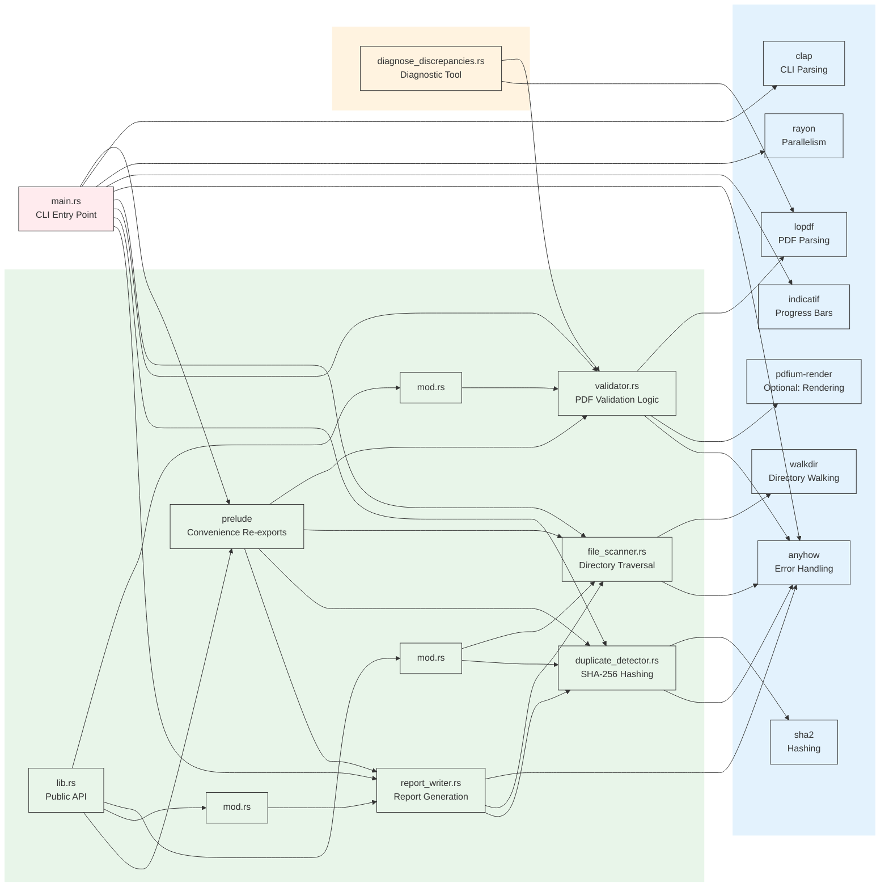

# Module Structure and Dependencies

## Module Responsibilities

### **Binary: main.rs**
- CLI argument parsing and validation
- Thread pool configuration
- Progress bar management
- Orchestrates validation workflow
- Handles user output and reporting

### **core::validator**
**Exports:**
- `validate_pdf()` - Standard validation
- `validate_pdf_with_lopdf()` - Lopdf-based validation
- `validate_pdf_basic()` - Fallback validation
- `validate_pdf_detailed()` - Validation with error details
- `validate_pdf_lenient()` - Permissive validation
- `validate_pdf_rendering()` - Optional rendering validation

**Dependencies:**
- `lopdf` - Primary PDF parsing
- `pdfium-render` - Optional rendering validation
- `anyhow` - Error handling

### **scanner::file_scanner**
**Exports:**
- `collect_pdf_files()` - Directory scanning
- `ValidationResult` - Result struct

**Dependencies:**
- `walkdir` - Recursive directory traversal
- `anyhow` - Error handling

### **scanner::duplicate_detector**
**Exports:**
- `compute_file_hash()` - SHA-256 file hashing
- `find_duplicates()` - Duplicate detection
- `DuplicateInfo` - Duplicate group struct

**Dependencies:**
- `sha2` - SHA-256 hashing
- `anyhow` - Error handling

### **reporting::report_writer**
**Exports:**
- `write_report()` - Comprehensive report generation
- `write_simple_report()` - Legacy format report

**Dependencies:**
- `scanner::file_scanner::ValidationResult`
- `scanner::duplicate_detector::DuplicateInfo`
- `anyhow` - Error handling

### **prelude**
Convenience module that re-exports commonly used types and functions for easier imports.
