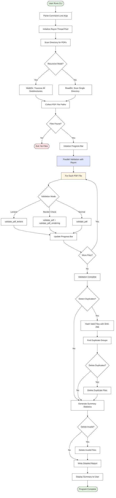

# Overall Program Flow

```mermaid
%%{init: {'theme':'base', 'themeVariables': { 'primaryColor':'#fff0','primaryTextColor':'#333','primaryBorderColor':'#333','lineColor':'#333','secondaryColor':'#fff0','tertiaryColor':'#fff0','background':'#fff0','mainBkg':'#fff0','secondBkg':'#fff0'}}}%%
flowchart TD
    Start([User Runs CLI]) --> Parse[Parse Command Line Args]
    Parse --> ThreadPool[Initialize Rayon Thread Pool]
    ThreadPool --> Scan[Scan Directory for PDFs]

    Scan --> CheckRecursive{Recursive Mode?}
    CheckRecursive -->|Yes| WalkDir[WalkDir: Traverse All Subdirectories]
    CheckRecursive -->|No| ReadDir[ReadDir: Scan Single Directory]

    WalkDir --> Collect[Collect PDF File Paths]
    ReadDir --> Collect

    Collect --> CheckEmpty{Files Found?}
    CheckEmpty -->|No| Exit1([Exit: No Files])
    CheckEmpty -->|Yes| Progress[Initialize Progress Bar]

    Progress --> Parallel[Parallel Validation with Rayon]

    Parallel --> ValidateLoop[For Each PDF File]
    ValidateLoop --> SelectMode{Validation Mode}

    SelectMode -->|Lenient| Lenient[validate_pdf_lenient]
    SelectMode -->|Render Check| RenderCheck[validate_pdf + validate_pdf_rendering]
    SelectMode -->|Normal| Normal[validate_pdf]

    Lenient --> UpdateProgress[Update Progress Bar]
    RenderCheck --> UpdateProgress
    Normal --> UpdateProgress

    UpdateProgress --> MoreFiles{More Files?}
    MoreFiles -->|Yes| ValidateLoop
    MoreFiles -->|No| Complete[Validation Complete]

    Complete --> CheckDuplicates{Detect Duplicates?}
    CheckDuplicates -->|Yes| HashFiles[Hash Valid Files with SHA-256]
    CheckDuplicates -->|No| Summarize

    HashFiles --> FindDups[Find Duplicate Groups]
    FindDups --> DeleteDups{Delete Duplicates?}
    DeleteDups -->|Yes| RemoveDups[Delete Duplicate Files]
    DeleteDups -->|No| Summarize
    RemoveDups --> Summarize

    Summarize[Generate Summary Statistics] --> CheckInvalid{Delete Invalid?}
    CheckInvalid -->|Yes| RemoveInvalid[Delete Invalid Files]
    CheckInvalid -->|No| Report
    RemoveInvalid --> Report

    Report[Write Detailed Report] --> Display[Display Summary to User]
    Display --> Exit2([Program Complete])

    style Start fill:#e1f5e1
    style Exit1 fill:#ffe1e1
    style Exit2 fill:#e1f5e1
    style Parallel fill:#e1e5ff
    style ValidateLoop fill:#fff4e1
```
