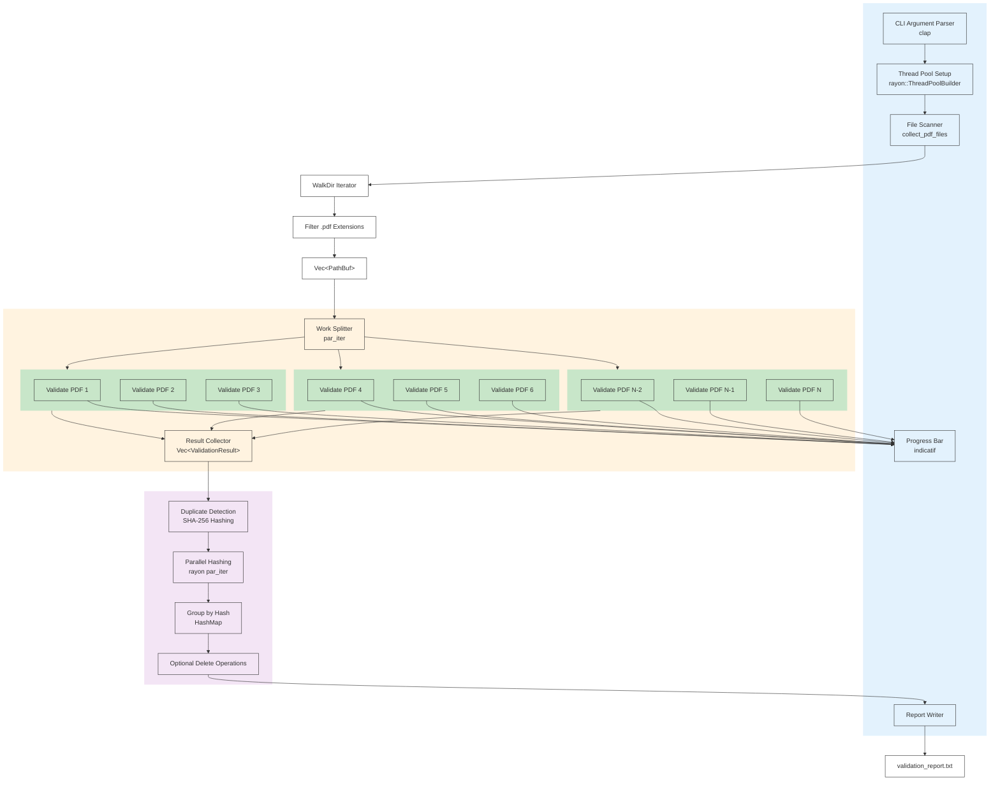

# Parallel Processing Architecture

## Processing Flow Details

### 1. Initialization
- Main thread parses CLI arguments
- Configures Rayon thread pool (default: CPU count)
- Scans directory for PDF files

### 2. Parallel Validation
- File list split across N worker threads
- Each worker validates PDFs independently
- Lock-free atomic counter for progress tracking
- Results collected into single vector

### 3. Post-Processing
- Duplicate detection runs in parallel
- Each file hashed independently
- HashMap groups files by hash
- Optional deletion operations

### Performance Characteristics
- **Scalability**: Linear scaling up to I/O bottleneck
- **Memory**: Streaming validation, minimal per-file overhead
- **Synchronization**: Lock-free counters, no mutex contention
- **Load Balancing**: Rayon work-stealing for optimal distribution
