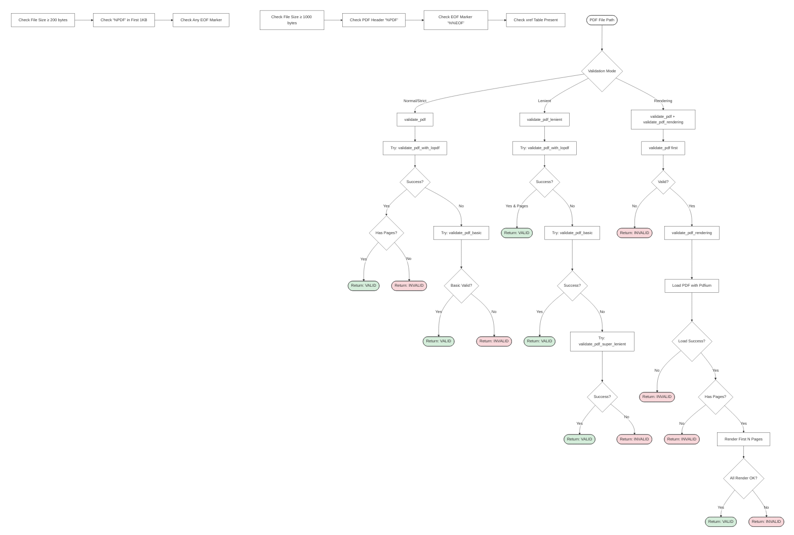

# PDF Validation Strategy

```mermaid
%%{init: {'theme':'base', 'themeVariables': { 'primaryColor':'#fff0','primaryTextColor':'#333','primaryBorderColor':'#333','lineColor':'#333','secondaryColor':'#fff0','tertiaryColor':'#fff0','background':'#fff0','mainBkg':'#fff0','secondBkg':'#fff0'}}}%%
flowchart TD
    Start([PDF File Path]) --> ModeCheck{Validation Mode}

    ModeCheck -->|Normal/Strict| NormalPath[validate_pdf]
    ModeCheck -->|Lenient| LenientPath[validate_pdf_lenient]
    ModeCheck -->|Rendering| RenderPath[validate_pdf + validate_pdf_rendering]

    %% Normal Path
    NormalPath --> Lopdf1[Try: validate_pdf_with_lopdf]
    Lopdf1 --> LopdfCheck1{Success?}
    LopdfCheck1 -->|Yes| PageCheck1{Has Pages?}
    PageCheck1 -->|Yes| Valid1([Return: VALID])
    PageCheck1 -->|No| Invalid1([Return: INVALID])
    LopdfCheck1 -->|No| Fallback1[Try: validate_pdf_basic]
    Fallback1 --> BasicResult1{Basic Valid?}
    BasicResult1 -->|Yes| Valid2([Return: VALID])
    BasicResult1 -->|No| Invalid2([Return: INVALID])

    %% Lenient Path
    LenientPath --> Lopdf2[Try: validate_pdf_with_lopdf]
    Lopdf2 --> LopdfCheck2{Success?}
    LopdfCheck2 -->|Yes & Pages| Valid3([Return: VALID])
    LopdfCheck2 -->|No| Basic2[Try: validate_pdf_basic]
    Basic2 --> BasicCheck2{Success?}
    BasicCheck2 -->|Yes| Valid4([Return: VALID])
    BasicCheck2 -->|No| SuperLenient[Try: validate_pdf_super_lenient]
    SuperLenient --> SuperCheck{Success?}
    SuperCheck -->|Yes| Valid5([Return: VALID])
    SuperCheck -->|No| Invalid3([Return: INVALID])

    %% Render Path
    RenderPath --> NormalValidate[validate_pdf first]
    NormalValidate --> NormalResult{Valid?}
    NormalResult -->|No| Invalid4([Return: INVALID])
    NormalResult -->|Yes| RenderCheck[validate_pdf_rendering]
    RenderCheck --> LoadPdfium[Load PDF with Pdfium]
    LoadPdfium --> PdfiumCheck{Load Success?}
    PdfiumCheck -->|No| Invalid5([Return: INVALID])
    PdfiumCheck -->|Yes| PageCountCheck{Has Pages?}
    PageCountCheck -->|No| Invalid6([Return: INVALID])
    PageCountCheck -->|Yes| RenderPages[Render First N Pages]
    RenderPages --> RenderResult{All Render OK?}
    RenderResult -->|Yes| Valid6([Return: VALID])
    RenderResult -->|No| Invalid7([Return: INVALID])

    %% Validation Methods Detail
    subgraph BasicValidation["validate_pdf_basic"]
        B1[Check File Size ≥ 1000 bytes]
        B2[Check PDF Header '%PDF']
        B3[Check EOF Marker '%%EOF']
        B4[Check xref Table Present]
        B1 --> B2 --> B3 --> B4
    end

    subgraph SuperLenientValidation["validate_pdf_super_lenient"]
        S1[Check File Size ≥ 200 bytes]
        S2[Check '%PDF' in First 1KB]
        S3[Check Any EOF Marker]
        S1 --> S2 --> S3
    end

    style Valid1 fill:#d4edda
    style Valid2 fill:#d4edda
    style Valid3 fill:#d4edda
    style Valid4 fill:#d4edda
    style Valid5 fill:#d4edda
    style Valid6 fill:#d4edda
    style Invalid1 fill:#f8d7da
    style Invalid2 fill:#f8d7da
    style Invalid3 fill:#f8d7da
    style Invalid4 fill:#f8d7da
    style Invalid5 fill:#f8d7da
    style Invalid6 fill:#f8d7da
    style Invalid7 fill:#f8d7da
```
